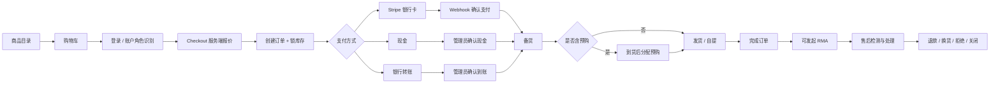

# 后台全流程闭环实施计划

创建时间：2026-05-20 14:57 CEST  
依据文件：`后台管理员面板功能检查报告.md`  
目标：把当前后台从“功能可用的 MVP”升级为“可真实接单、可追踪、可回滚、可审计、可持续运营”的生产后台。

## 1. 总体判断

当前后台已经具备完整骨架：商品、库存、订单、客户、B2B、RMA、系统健康、三种支付方式、购物车和接单流程都已经打通。接下来不应该优先继续堆页面，而应该优先补强真实运营最怕出错的地方：

- 权限不能漏。
- 库存不能乱。
- 订单状态不能越权跳转。
- 现金和转账必须有凭证。
- RMA 必须能从申请走到处理结果。
- 管理员每一次关键操作都必须能追踪。

本计划按“上线前硬化 → 运营闭环 → 效率规模化”推进。

## 2. 目标状态

### 业务闭环目标

客户侧：

1. 浏览商品。
2. 筛选品牌、型号、品类、质量、库存状态。
3. 加入购物车。
4. 登录后结账。
5. 根据账号类型显示零售价或 B2B 价。
6. 选择银行卡、现金或银行转账。
7. 创建订单并锁定现货或在途库存。
8. 在账户中心查看订单、付款、履约、售后状态。
9. 可提交 RMA，并看到售后处理进度。

管理员侧：

1. 审核 B2B 客户。
2. 维护商品、价格、中文名、参数和上下架状态。
3. 导入采购单，确认到货、缺货和库存调整。
4. 接收订单，确认现金/转账/Stripe 支付。
5. 备货、分配预购、发货/自提、完成订单。
6. 处理 RMA：收件、检测、退款/换货/拒绝、关闭。
7. 查看所有关键操作的审计记录。
8. 通过系统页和通知中心发现配置、库存、付款、售后风险。

## 3. 角色与权限设计

第一版继续保留现有 `profiles.role`，但权限逻辑要更明确。

| 角色 | 说明 | 价格权限 | 前台能力 | 后台能力 |
| --- | --- | --- | --- | --- |
| `anon` | 未登录游客 | 不可见 | 浏览商品、筛选、加入本地购物车 | 无 |
| `retail` / 空角色 | 普通零售用户 | 只看零售价 | 下单、查看自己的订单/RMA | 无 |
| `b2b` | 已审核批发客户 | B2B 价 | 批发下单、查看自己的订单/RMA | 无 |
| `admin` | 管理员 | B2B 价 + 后台成本/库存 | 全部前台能力 | 全部后台能力 |

后续可扩展多角色：

| 未来角色 | 权限范围 |
| --- | --- |
| `owner` | 全权限、系统配置、管理员管理 |
| `finance` | 收款确认、退款、财务报表 |
| `warehouse` | 到货、库存、备货、发货 |
| `support` | RMA、客户备注、售后沟通 |
| `catalog_manager` | 商品、参数、翻译、价格维护 |

权限原则：

- 前台接口永远不相信前端价格和库存。
- 后台页面由 `/[locale]/admin/layout.tsx` 保护。
- 后台 mutation API 必须调用 `assertAdmin()`。
- 高风险后台 POST 需要 CSRF token。
- 所有库存、收款、订单状态、价格和客户权限变更必须写入 `admin_activity_logs`。

## 4. 功能关系图



## 5. 库存与订单状态逻辑

### 库存字段关系

| 字段 | 含义 | 何时增加 | 何时减少 |
| --- | --- | --- | --- |
| `stock_on_hand` | 实际仓库现货 | 到货确认、手动调增 | 发货/自提完成、手动调减 |
| `stock_reserved` | 已被订单锁定的现货 | 创建订单锁现货、预购到货分配后转现货锁定 | 取消释放、发货/自提完成 |
| `incoming_qty` | 已向供应商订购但未到货 | Excel/采购单导入 | 到货确认、缺货标记 |
| `incoming_reserved` | 已被客户预购锁定的在途 | 创建订单锁预购 | 取消释放、到货后分配为 `stock_reserved` |

可售现货：

```text
available_stock = stock_on_hand - stock_reserved
```

可预购在途：

```text
available_incoming = incoming_qty - incoming_reserved
```

### 订单状态建议

| 订单状态 | 说明 | 允许动作 |
| --- | --- | --- |
| `pending_payment` | 等待付款 | 确认收款、取消释放、延长锁库 |
| `paid` | 已付款 | 开始备货、取消退款流程 |
| `processing` | 备货中 | 分配预购、发货、自提 |
| `shipped` | 已发货 | 完成订单、创建售后 |
| `completed` | 已完成 | 创建售后、查看审计 |
| `cancelled` | 已取消 | 只读 |

支付状态：

| 支付状态 | 来源 |
| --- | --- |
| `pending_card` | Stripe Checkout 已创建但未成功 |
| `pending_cash` | 现金待收 |
| `pending_bank_transfer` | 银行转账待确认 |
| `paid` | Stripe webhook 或管理员确认 |
| `failed` | Stripe 失败 |
| `cancelled` | 订单取消或过期释放 |
| `refunded` | 后续退款流程 |

履约状态：

| 履约状态 | 含义 |
| --- | --- |
| `reserved` | 库存/在途已锁定 |
| `picking` | 仓库备货中 |
| `waiting_preorder` | 等待预购到货 |
| `allocated` | 预购已分配为可发货 |
| `shipped` | 已发货 |
| `picked_up` | 已自提 |
| `completed` | 已完成 |
| `cancelled` | 已取消 |

## 6. 数据库与后端改造计划

### 新增表

#### `admin_activity_logs`

记录所有高风险后台操作。

关键字段：

- `id`
- `actor_profile_id`
- `actor_email`
- `action`
- `entity_type`
- `entity_id`
- `before_data`
- `after_data`
- `ip_address`
- `user_agent`
- `created_at`

必须记录的操作：

- 商品价格、名称、上下架修改
- 库存手动调整
- Excel 导入、到货确认、缺货标记
- 现金/转账确认收款
- Stripe webhook 改变订单状态
- 取消订单、释放锁库
- 发货、自提、完成订单
- B2B 审核和客户价格组修改
- RMA 状态和处理结果修改

#### `order_payments`

保存现金、银行转账、Stripe 的付款明细。

关键字段：

- `id`
- `order_id`
- `method`
- `status`
- `amount`
- `currency`
- `reference`
- `proof_url`
- `stripe_checkout_session_id`
- `stripe_payment_intent_id`
- `received_at`
- `confirmed_by`
- `note`
- `created_at`

#### `order_fulfillment_events`

保存备货、发货、自提、完成的履约事件。

关键字段：

- `id`
- `order_id`
- `event_type`
- `carrier`
- `tracking_number`
- `pickup_code`
- `handled_by`
- `note`
- `created_at`

#### `rma_events`

保存售后处理时间线。

关键字段：

- `id`
- `rma_id`
- `event_type`
- `status_from`
- `status_to`
- `resolution`
- `refund_amount`
- `replacement_sku`
- `attachment_url`
- `handled_by`
- `note`
- `created_at`

### 新增或替换 RPC

高风险写入要从 JavaScript 多步更新迁移到 Postgres RPC，确保事务一致性。

| RPC | 责任 |
| --- | --- |
| `create_order_with_reservations(payload jsonb)` | 创建订单、订单项、锁库存、写库存流水，任一步失败整体回滚 |
| `release_order_reservations(order_id uuid, reason text)` | 取消订单并释放 `stock_reserved/incoming_reserved` |
| `confirm_manual_order_payment(order_id uuid, method text, payment jsonb)` | 确认现金/转账、写付款记录、写审计日志 |
| `allocate_order_preorders(order_id uuid)` | 到货后把 `incoming_reserved` 转为 `stock_reserved` |
| `ship_or_pickup_order(order_id uuid, mode text, payload jsonb)` | 发货/自提时扣真实库存、释放锁定、写履约事件 |
| `complete_order(order_id uuid)` | 完成订单并写履约事件 |
| `adjust_inventory_with_audit(payload jsonb)` | 手动调整库存、写库存流水、写审计日志 |

RPC 原则：

- 使用服务端调用，不开放给匿名用户。
- 如必须放在 `public` schema，RLS 和权限要严格；更推荐放到 `app_private` 或受控 schema。
- 使用行锁防止并发超卖。
- 返回结构化错误，方便前端显示。

## 7. API 改造计划

### 安全与权限

- `/api/admin/health` 加 `assertAdmin()`。
- 所有后台 mutation 接口统一调用 `assertAdmin()`。
- 所有后台表单 POST 加 CSRF token。
- 商品相关 `returnTo` 只允许 `/zh/admin/...` 或 `/it/admin/...`。
- Cron 接口继续使用 `CRON_SECRET`。

### 订单接口

- `/api/orders` 改为调用 `create_order_with_reservations()`。
- `/api/admin/orders/payment` 改为调用 `confirm_manual_order_payment()`。
- `/api/admin/orders/release` 改为调用 `release_order_reservations()`。
- `/api/admin/orders/allocate-preorders` 改为调用 `allocate_order_preorders()`。
- `/api/admin/orders/fulfillment` 改为调用 `ship_or_pickup_order()` / `complete_order()`。
- `/api/stripe/webhook` 成功/失败事件写入 `order_payments` 和 `admin_activity_logs`。

### RMA 接口

- `/api/rma` 创建 RMA 时生成 RMA 编号。
- `/api/admin/rma/status` 只负责状态流转是不够的，需要扩展为处理事件：
  - 收到退货
  - 检测通过/失败
  - 退款
  - 换货
  - 拒绝
  - 关闭

### 搜索与分页

- 后台列表统一支持：
  - `q`
  - `status`
  - `page`
  - `sort`
  - `from`
  - `to`
- 读取数据使用 Supabase `range()` 分页。

## 8. 后台页面完善计划

### 系统页

必须完善：

- 仅管理员可调用健康接口。
- 显示 Supabase、Stripe、Google OAuth、Cron、Vercel env 状态。
- 显示最近一次 Cron 执行结果。
- 显示当前部署 commit 和构建时间。

### 订单页

必须完善：

- 全局搜索订单号、客户邮箱、公司名、SKU。
- 状态、支付方式、履约状态、日期范围筛选。
- 订单详情显示：
  - 付款记录
  - 履约记录
  - 库存锁定记录
  - 管理员操作日志
  - 客户备注
- 操作按钮按状态启用/禁用。

### 库存页

必须完善：

- 扫码/EAN 搜索。
- 采购单详情页。
- 到货确认支持按行保存。
- 缺货原因。
- 库存调整必须填写原因。
- 库存流水可按 SKU、EAN、日期、类型筛选。

### 商品页

必须完善：

- SKU/EAN/名称搜索。
- 分页。
- 批量改状态前显示确认摘要。
- 价格低于成本时提醒。
- 有锁定库存的 SKU 禁止直接归档，或要求二次确认。

### 客户页

必须完善：

- 客户搜索。
- 客户订单总额、最近下单、待处理 RMA。
- 备注/标签/任务可编辑删除。
- B2B 申请与客户档案合并。

### RMA 页

必须完善：

- RMA 编号。
- 附件查看。
- 处理时间线。
- 检测结果。
- 退款/换货/拒绝处理表单。
- 与原订单和 SKU 关联。

### 通知中心

建议新增：

- 新订单
- 待确认现金/转账
- Stripe 失败
- 即将过期锁库
- 预购到货待分配
- 低库存
- 新 RMA
- 新 B2B 申请

## 9. 分阶段实施计划

### 阶段 A：上线前安全硬化

目标：先解决后台安全边界和明显风险。

状态：进行中，第一批和第二批已完成

任务：

- 保护 `/api/admin/health`。已完成
- 新增后台安全 helper：`getAdminBackUrl()`。已完成
- 修正商品 update/publish/archive 的 `returnTo` 校验。已完成
- 增加 `admin_activity_logs` migration 和写入 helper。已完成
- 关键 API 接入审计日志。已完成第一批，覆盖商品、目录、库存、订单、客户价格组、B2B、RMA
- 后台 mutation 表单增加 CSRF token。已完成
- 新增 `assertAdminOrJson()` 等 JSON API 统一错误 helper。待下一批实施

验收：

- 未登录访问 `/api/admin/health` 返回 401/403。
- 普通用户访问后台 API 返回 403。
- 恶意 `returnTo=https://...` 不会跳出本站。
- 商品、库存、订单、B2B、RMA 的关键操作能写入审计表。

第一批实施记录：

- 新增 `src/lib/admin-security.ts`，统一后台回跳 URL 校验。
- 新增 `src/lib/admin-audit.ts`，管理员审计日志写入采用 best-effort，不阻断主业务流程。
- 新增 `supabase/migrations/20260520160000_admin_activity_logs.sql`。
- 远程 Supabase 项目 `tgvpmzpbuvegfehptqxh` 已应用 `admin_activity_logs` migration。
- `npm run lint`、`npm run typecheck`、`npm run build` 已通过；构建在普通沙盒因 Turbopack 内部端口权限失败，外部授权重跑通过。

第二批实施记录：

- 新增 `src/lib/admin-csrf.ts`，实现后台 CSRF token 生成、cookie 双提交校验和常量时间比较。
- 新增 `src/components/admin/admin-csrf-field.tsx`，所有后台表单统一注入隐藏 token。
- 更新 `src/proxy.ts`，访问后台页面和 `/api/admin/*` 时自动下发 8 小时有效的 `partspro_admin_csrf` HttpOnly cookie。
- 所有后台表单 POST 接口已接入 `redirectOnInvalidAdminCsrf()`；`/api/admin/orders/release-expired` 保留 `CRON_SECRET` 机制，不走表单 CSRF。
- `npm run lint`、`npm run typecheck`、`npm run build` 已通过；构建在普通沙盒因 Turbopack 内部端口权限失败，外部授权重跑通过。

### 阶段 B：订单与库存事务化

目标：防止超卖、幽灵锁库、部分扣库存。

状态：进行中，第一批已完成

任务：

- 新增订单/库存 RPC。已完成第一批：`create_order_with_reservations(payload jsonb)`
- `/api/orders` 改用 `create_order_with_reservations()`。已完成
- 取消、释放、到货分配、发货、自提、完成改用 RPC。
- 订单状态流转加服务端校验。
- 失败返回统一错误结构。

验收：

- 多 SKU 订单中任一 SKU 不足时，订单不创建，库存不变化。
- 取消订单能完整释放现货和在途锁定。
- 发货失败时不出现部分 SKU 已扣库存。
- 重复点击后台按钮不会重复扣库存或重复释放。

第一批实施记录：

- 新增 `supabase/migrations/20260520170000_order_create_reservation_rpc.sql`。
- 远程 Supabase 项目 `tgvpmzpbuvegfehptqxh` 已应用 `order_create_reservation_rpc` migration。
- 新 RPC 会在数据库事务中创建订单、写订单项、重新计算并锁定现货/在途库存、写库存流水。
- RPC 使用库存行 `for update` 锁，任一 SKU 库存不足或 MOQ 不满足时整体回滚。
- 函数执行权限已收紧：`anon=false`、`authenticated=false`、`service_role=true`。
- `/api/orders` 已改为调用 RPC，移除原先插订单、插订单项、逐行锁库存的非事务路径。
- `npm run lint`、`npm run typecheck`、`npm run build` 已通过；构建在普通沙盒因 Turbopack 内部端口权限失败，外部授权重跑通过。

### 阶段 C：付款凭证与履约闭环

目标：现金、银行转账、Stripe 都有可查凭证。

状态：待开始

任务：

- 新增 `order_payments`。
- 新增 `order_fulfillment_events`。
- 现金/转账确认表单增加金额、参考号、备注、到账时间。
- Stripe webhook 写入付款记录。
- 发货/自提表单增加物流公司、单号、自提备注。
- 订单详情显示付款和履约时间线。

验收：

- 后台确认现金/转账后，订单显示付款记录。
- Stripe 成功后，订单和付款记录一致。
- 发货后可看到物流信息。
- 已完成订单保留完整操作轨迹。

### 阶段 D：RMA 售后闭环

目标：从“状态流转”升级为真实售后处理。

状态：待开始

任务：

- 新增 RMA 编号。
- 新增 `rma_events`。
- 后台 RMA 详情增加收件、检测、退款、换货、拒绝、关闭表单。
- 客户账户 RMA 详情显示处理时间线。
- RMA 与订单项/SKU 强关联。

验收：

- 客户提交 RMA 后获得 RMA 编号。
- 管理员能记录检测结果。
- 退款/换货/拒绝有明确处理结果。
- 客户能看到售后进度。

### 阶段 E：运营效率与上线验收

目标：让管理员能高效处理增长后的数据。

状态：待开始

任务：

- 后台全局搜索。
- 商品、订单、客户、RMA、库存分页。
- 通知中心。
- 导出 CSV/XLSX。
- 系统页显示部署、Cron、Stripe、Google OAuth 状态。
- 线上完整验收三条支付路径。

验收：

- 管理员可通过一个搜索框找到订单、SKU、客户、RMA。
- 列表超过 300 条仍可分页访问。
- 线上 Stripe 测试卡成功/失败/过期事件均正确。
- 现金、转账、银行卡三条订单路径都能进入后台闭环。

## 10. 推荐执行顺序

第一轮最建议做：

1. `/api/admin/health` 鉴权。
2. `returnTo` 安全 helper。
3. `admin_activity_logs` 表和写入 helper。
4. 订单库存 RPC 设计和 migration。
5. `/api/orders` 改用 RPC。

第二轮：

1. 后台订单动作全部改用 RPC。
2. 现金/转账付款凭证。
3. 订单详情时间线。
4. RMA 处理事件。

第三轮：

1. 后台搜索分页。
2. 通知中心。
3. 导出报表。
4. 多员工角色。

## 11. 测试计划

每个阶段必须执行：

- `npm run lint`
- `npm run typecheck`
- `npm run build`

阶段 A 额外测试：

- 未登录调用后台 API。
- 普通用户调用后台 API。
- 管理员调用后台 API。
- 恶意 returnTo。
- 审计日志是否写入。

阶段 B 额外测试：

- 单 SKU 现货订单。
- 单 SKU 预购订单。
- 多 SKU 混合订单。
- 库存不足订单。
- 并发下单。
- 取消释放。
- 发货扣库存。

阶段 C 额外测试：

- 现金确认。
- 转账确认。
- Stripe 成功。
- Stripe 过期。
- Stripe 失败。
- 付款记录和订单状态一致。

阶段 D 额外测试：

- 客户提交 RMA。
- 管理员检测。
- 管理员退款。
- 管理员换货。
- 管理员拒绝。
- 客户查看进度。

## 12. 上线阻塞项

- Stripe keys 和 webhook secret 必须补齐。
- Google OAuth 生产回调 URL 必须确认。
- 管理员账号必须在 `profiles.role = 'admin'` 或匹配 `ADMIN_EMAIL`。
- 阶段 B 的库存事务化完成前，不建议大规模真实接单。
- 阶段 C 的付款凭证完成前，不建议大量现金/转账订单。

## 13. 当前状态

| 模块 | 状态 |
| --- | --- |
| 后台功能骨架 | 已完成 |
| 用户下单闭环 | 已完成基础版 |
| 后台接单闭环 | 已完成基础版 |
| 权限硬化 | 待开始 |
| 审计日志 | 待开始 |
| 库存事务 RPC | 待开始 |
| 付款凭证 | 待开始 |
| RMA 处理闭环 | 待开始 |
| 后台搜索分页 | 待开始 |
| 线上 Stripe 验收 | 阻塞 |

## 14. 下一步行动

建议立即进入阶段 A：

1. 加固 `/api/admin/health`。
2. 抽取后台安全跳转 helper。
3. 新增 `admin_activity_logs` migration。
4. 给订单、库存、商品、B2B、RMA 的关键操作接入审计日志。

完成阶段 A 后，再进入阶段 B，把订单库存改成数据库事务，解决真实上线时最危险的库存一致性问题。
